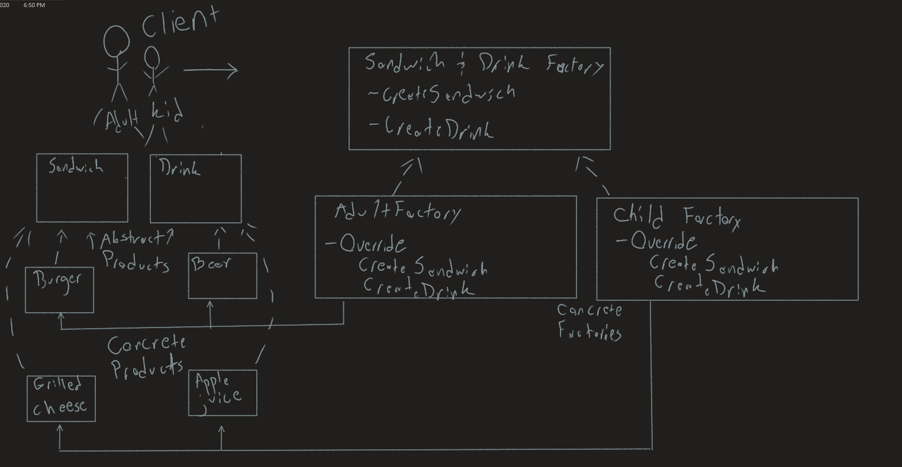
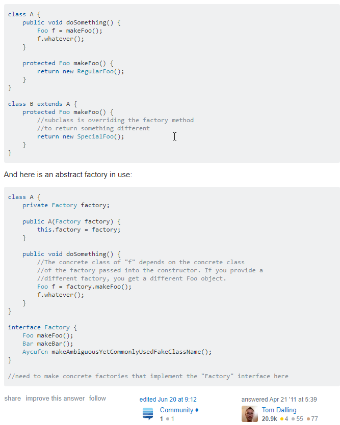

# Abstract Factory
Author: *Nicco Ryan*

This console app was made to explain the Abstract Factory design pattern and showcase a basic real-world type example of it's use.

## What is Abstract Factory?
- Abstract Factories declares an interface for the creation of Abstract Products.
- Concrete Factory objects carry out the creation by implementing an Abstract Factory’s interface.
- Abstract Products declare interfaces for types of products.
- Products define a product object, created by the corresponding Concrete Factory and used by the user through the Abstract interface.
- Clients interact with the Abstract Factories and Products, and has no knowledge of which factory is producing the products. 

Reference for Pattern and Example used: https://www.exceptionnotfound.net/abstract-factory-pattern-in-csharp/

## Example image

## Factory Method Vs. Abstract Factory

